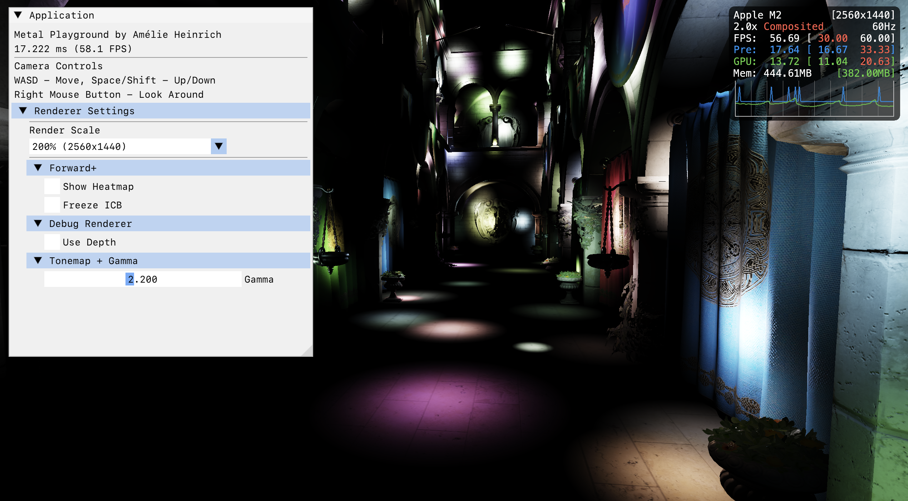

# Metal Playground

Playground where I mess around with Metal on iOS and macOS.

## Features

- Cook-Torrance BRDF, PBR workflow
- Deferred shading
- Clustered light culling
- GPU driven rendering and culling
- Raytraced sun shadows
- Works on iOS and macOS

## Requirements

- iOS 16.0+
- macOS 15.0+
- KTX Texture Tools (for ASTC compression)

## Building and running

Before you build, you need to compress every asset with `scripts/compress_assets.sh`

iOS: `scripts/build_ios_simulator.sh`
macOS: `scripts/build.sh`
